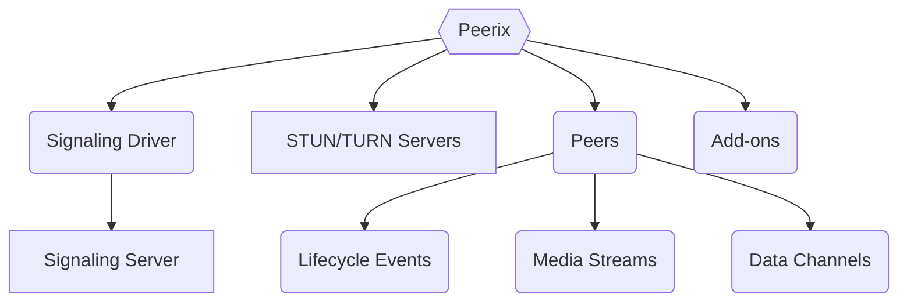

# Peerix

It is a peer-to-peer media and data sharing JavaScript library. Peerix uses WebRTC for peer-to-peer communication and relies on a signaling mechanism to facilitate peer discovery and connection management. The library abstracts away the complexities of WebRTC and provides a minimalistic API for developers to create real-time applications with media streaming and data sharing capabilities.

Read the full documentation and API reference on the official website:
- [Documentation](https://peerix.dev/docs)
- [API Reference](https://api.peerix.dev)
- [Discussions](https://github.com/peerix-dev/peerix/discussions)
- [Issues](https://github.com/peerix-dev/peerix/issues)

## How It Works

Peerix is a front-end library that runs entirely in the browser, which allows for low-latency media streaming and data sharing between peers. The library abstracts away the complexities of WebRTC and provides a simple API for developers to create real-time peer-to-peer applications with media streaming and data sharing capabilities.

It is designed to work in a decentralized manner, allowing peers to connect directly to each other without relying on a central server for media relay. However, it does require a signaling server for peers to discover each other and establish connections. You can use various built-in signaling drivers, or you can implement your own custom driver to fit your application's needs.

Peerix uses ICE (Interactive Connectivity Establishment) to establish peer-to-peer connections. You can use public STUN servers for NAT traversal. However, for better connectivity and performance, especially in restrictive network environments, it is recommended to use your own TURN server or a third-party TURN service.

Here is a high-level overview of the Peerix architecture:



Peerix is not an SFU (Selective Forwarding Unit) or MCU (Multipoint Control Unit), and it does not provide server-side media processing or routing capabilities. Instead, it focuses on enabling direct peer-to-peer communication between clients, allowing you to build applications that leverage the full potential of WebRTC without the need for a central media server.

## Quick Start

Install the Peerix library via NPM:

```sh
npm install peerix
```

Use the library in your JavaScript or TypeScript code to create peer-to-peer connections, exchange messages, and share media streams:

```js
import { Peer, BroadcastChannelDriver } from 'peerix';

// create a signaling driver
const driver = new BroadcastChannelDriver();

// create the Peer instance
const peer = new Peer({ driver });

// listen for peer connections
peer.on('join', (e) => {
  const { remote } = e;
  console.log(
    'Connected to peer:', remote.id, 
    'with metadata:', remote.metadata
  );
});

// listen for peer disconnections
peer.on('leave', (e) => {
  const { remote } = e;
  console.log(
    'Disconnected from peer:', remote.id
  );
});

// listen for errors
peer.on('error', (e) => {
  const { error } = e;
  console.error('Error:', error);
});

// join a room
peer.join({
  room: 'room-id',
  metadata: { /* optional metadata */ }
});

// later, if you want to leave the room
// peer.leave();
```

Work with data channels to exchange messages with other peers:

```js
// listen for open channel event
peer.on('open', (e) => {
  const { remote, channel } = e;
  console.log(
    'Channel opened with peer:', remote.id, 
    'channel:', channel.id
  );
  // send a message to the connected peer
  channel.send('Hello, peer!');
});

// listen for close channel event
peer.on('close', (e) => {
  const { remote, channel } = e;
  console.log(
    'Channel closed with peer:', remote.id, 
    'channel:', channel.id
  );
});

// listen for incoming messages
peer.on('message', (e) => {
  const { remote, channel, data } = e;
  console.log(
    'Received message from peer:', remote.id,
    'channel:', channel.id,
    'data:', data
  );
});

// open a data channel with a specific id
peer.open({ id: 0, label: 'chat' });

// send a message to each connected peer via a specific data channel
peer.send('Hello, peers!', { id: 0 });

// later, if you want to close the data channel
// peer.close({ id: 0 });
```

Work with media streams to share audio and video with other peers:

```js
// listen for peer publishing a track in a stream
peer.on('publish', (e) => {
  const { remote, stream, track } = e;
  console.log(
    'Peer published a track:', track.id,
    'in stream:', stream.id,
    'from peer:', remote.id
  );
});

// listen for peer unpublishing a track in a stream
peer.on('unpublish', (e) => {
  const { remote, stream, track } = e;
  console.log(
    'Peer unpublished a track:', track.id,
    'from stream:', stream.id,
    'from peer:', remote.id
  );
});

// get a media stream from the user's camera and microphone
const stream = await navigator.mediaDevices.getUserMedia(
  { video: true, audio: true }
);

// publish or update the stream to the room
peer.publish({ id: 'camera', stream });

// later, if you want to stop sharing the stream, you can unpublish it
// peer.unpublish({ id: 'camera' });
```

## Signaling Drivers

Peerix supports multiple signaling drivers for peer discovery and connection management. You can choose the driver that best fits your application's needs:
- `MemoryDriver`: A simple in-memory driver for testing and development. It allows several peer instances to discover each other within one browser page.
- `BroadcastChannelDriver`: Uses the BroadcastChannel API for communication between tabs in the same browser.
- `NatsDriver`: Uses [NATS](https://nats.io/) messaging system for communication between peers across different browsers and devices over the internet. It supports E2EE to protect the privacy of signaling messages and is recommended for production applications.

We also plan to add more built-in drivers in the future, such as:
- `WebSocketDriver`: A simple [WebSocket](https://developer.mozilla.org/en-US/docs/Web/API/WebSocket)-based driver that can be used with any WebSocket server. This driver is useful for applications that already have a WebSocket backend in place or for those who want to implement their own custom signaling server.
- `SocketIoDriver`: A driver that uses [Socket.IO](https://socket.io/) for signaling. This driver is suitable for applications that use Socket.IO for real-time communication and want to integrate Peerix with their existing Socket.IO infrastructure.
- `SupabaseDriver`: A driver that uses [Supabase](https://supabase.com/realtime)'s real-time features for signaling. This driver is ideal for applications that use Supabase as their backend and want to leverage its real-time capabilities for peer discovery and connection management.

You can also implement your own custom signaling driver by adhering to the following interface:

```js
class CustomDriver {
  on(namespace, handler) { /* ... */ }
  off(namespace, handler) { /* ... */ }
  emit(namespace, message) { /* ... */ }
}
```

This driver interface allows you to integrate Peerix with any signaling mechanism you prefer.

> [!TIP]
> Use NATS for production applications. It is a high-performance messaging system that enables efficient communication between peers for signaling purposes directly from the browser.

If you do not want to create your own signaling server, you can use the NATS driver with a public NATS server or set up your own NATS server for better performance and reliability. Using NATS allows you to use Peerix without any server-side code because all signaling is handled through NATS servers directly from the browser.

```js
import { NatsDriver } from 'peerix';
import { connect } from 'nats.ws';

// create the NATS driver instance
const driver = new NatsDriver({
  // NATS connection instance
  connect: async () => {
    // to create a connection to a nats-server
    // (the public NATS server is not for production use)
    return await connect({ servers: ['wss://demo.nats.io:8443'] });
  },
  // optional secret for E2EE of signaling messages
  secret: 'my-secret-key',
});
```

You should install the `nats.ws` package to use the NATS Driver, as it provides a WebSocket client for connecting to NATS servers from the browser.

## ICE Servers

ICE (Interactive Connectivity Establishment) is a framework used in WebRTC to find the best path to connect peers. It involves using STUN (Session Traversal Utilities for NAT) servers for NAT traversal and TURN (Traversal Using Relays around NAT) servers for relaying media when direct peer-to-peer connections are not possible.

> [!TIP]
> Use TURN servers for better connectivity in restrictive network environments.

Peerix allows you to specify ICE servers for better connectivity and performance, especially in restrictive network environments. Use `iceServers` option when creating the `Peer` instance to provide custom STUN and TURN servers:

```js
// create the Peer instance with custom ICE servers
const peer = new Peer({
  // use signaling driver, such as NATS
  driver,
  // specify custom ICE servers for better connectivity
  iceServers: [
    // public STUN server
    { urls: 'stun:stun.l.google.com:19302' },
    // custom TURN server (replace with your own server)
    {
      urls: 'turn:turn.example.com:3478',
      username: 'user',
      credential: 'pass'
    },
  ],
});
```

## License

### Open Source License

Peerix is a WebRTC peer-to-peer JavaScript/TypeScript library.

Copyright (C) 2026 Peerix

This program is free software: you can redistribute it and/or modify
it under the terms of the GNU General Public License as published by
the Free Software Foundation, either version 3 of the License, or
(at your option) any later version.

This program is distributed in the hope that it will be useful,
but WITHOUT ANY WARRANTY; without even the implied warranty of
MERCHANTABILITY or FITNESS FOR A PARTICULAR PURPOSE.  See the
GNU General Public License for more details.

You should have received a copy of the GNU General Public License
along with this program. If not, see <https://www.gnu.org/licenses/>.

### Commercial License

For proprietary applications or if you do not wish to comply with the GPL license, please contact the [Peerix Team](https://peerix.dev/contact) to discuss commercial licensing options.
